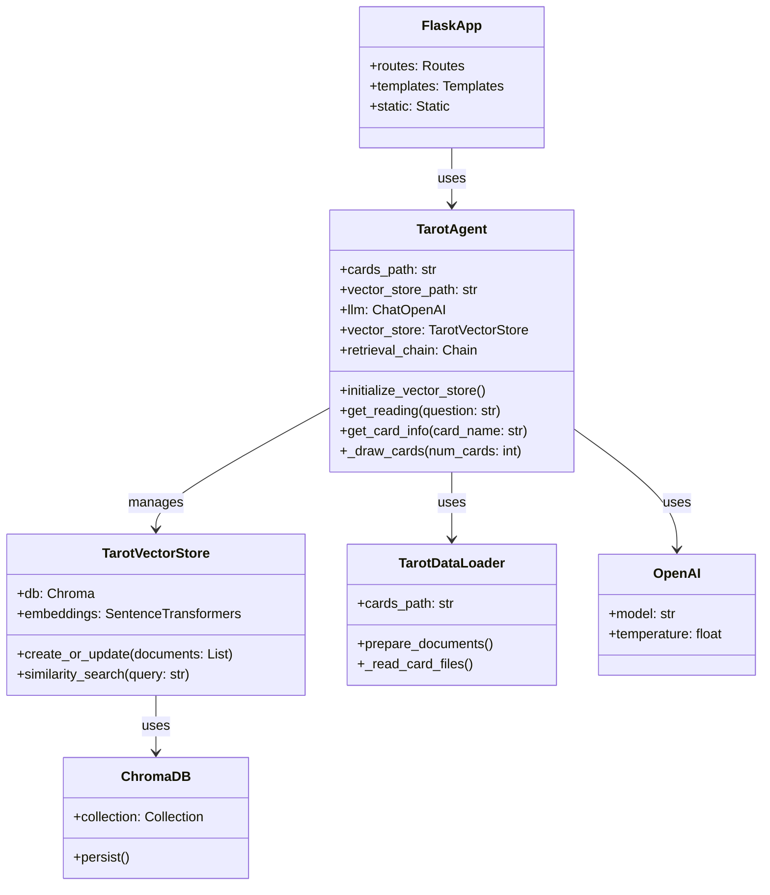
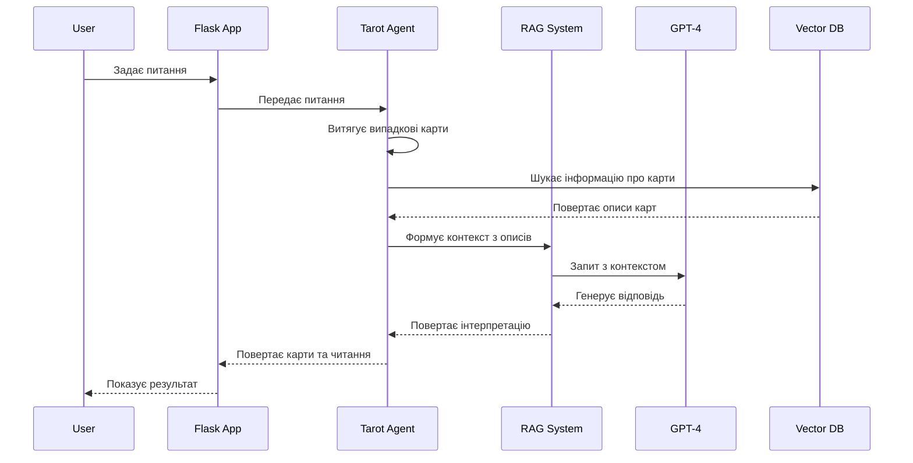
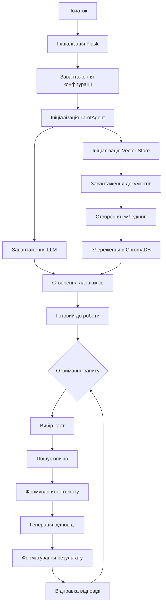

# Tarot AI Agent

Tarot AI Agent - це Flask-додаток, який використовує LangChain та RAG (Retrieval Augmented Generation) для генерації інтерпретацій карт Таро на основі структурованих описів.

## Архітектура

### Діаграма класів



### Діаграма послідовності



### Діаграма процесів



### Компоненти системи

1. **Flask Backend**
   - Обробка HTTP-запитів
   - Маршрутизація
   - Інтеграція з AI-агентом

2. **AI Agent (LangChain)**
   - Векторна база даних (ChromaDB)
   - Ембедінги (SentenceTransformers)
   - LLM (GPT-4-turbo-preview)
   - Ланцюжки обробки запитів

3. **Frontend**
   - Адаптивний веб-інтерфейс
   - Автоматичний вибір карт
   - Відображення карт та інтерпретацій

### Структура проекту

```
tarot/
├── app/
│   ├── __init__.py
│   ├── routes.py
│   ├── tarot_agent/
│   │   ├── __init__.py
│   │   ├── agent.py
│   │   ├── data_loader.py
│   │   └── vector_store.py
│   ├── static/
│   │   ├── css/
│   │   ├── images/cards/
│   │   └── js/
│   └── templates/
│       └── index.html
├── vector_store/          # Ігнорується в git
├── requirements.txt
├── run.py
├── init_db.py
└── verify_db.py
```

## Встановлення та налаштування

1. **Клонування репозиторію**
   ```bash
   git clone https://github.com/your-username/tarot.git
   cd tarot
   ```

2. **Створення віртуального середовища**
   ```bash
   python -m venv venv
   source venv/bin/activate  # для Unix
   # або
   venv\Scripts\activate  # для Windows
   ```

3. **Встановлення залежностей**
   ```bash
   pip install -r requirements.txt
   ```

4. **Налаштування середовища**
   - Скопіюйте `.env.example` в `.env`
   - Додайте свій OpenAI API ключ
   ```bash
   cp env.example .env
   # Відредагуйте .env файл, додавши свій OPENAI_API_KEY
   ```

## Ініціалізація векторної бази

1. **Запуск ініціалізації**
   ```bash
   python init_db.py
   ```
   Скрипт:
   - Завантажить описи карт з текстових файлів
   - Створить ембедінги
   - Збереже їх у ChromaDB

2. **Перевірка ініціалізації**
   ```bash
   python verify_db.py
   ```
   Скрипт перевірить:
   - Кількість завантажених документів
   - Наявність описів для всіх карт
   - Коректність метаданих

## Запуск додатку

1. **Локальний запуск**
   ```bash
   python run.py
   ```
   Додаток буде доступний за адресою: http://localhost:8080

2. **Docker (опціонально)**
   ```bash
   docker-compose up --build
   ```

## Тестування

### Тестування RAG (test_rag.py)

Скрипт для тестування роботи RAG системи та генерації відповідей:
```bash
python test_rag.py
```

**Що тестується:**
1. Ініціалізація агента:
   - Завантаження моделі LLM
   - Підключення до векторної бази
   - Створення ланцюжків обробки

2. Обробка запитів:
   - "Що означає карта Маг?"
   - "Розкажи про карту Смерть"
   - "Що символізує Колесо Фортуни?"
   - "Опиши значення карти Місяць"
   - "Що означає Туз Кубків?"

3. Функціональність:
   - Автоматичний вибір карт
   - Визначення положення карт (пряме/перевернуте)
   - Генерація шляхів до зображень
   - Форматування відповідей

**Приклад виводу:**
```
Запит: Що означає карта Маг?

Витягнуті карти:
- The World (перевернута)
- The Hermit (пряма)
- The Devil (перевернута)

Відповідь:
[Детальна інтерпретація карт...]
```

### Аналіз документів (check_documents.py)

Скрипт для глибокого аналізу завантажених документів у векторній базі:
```bash
python check_documents.py
```

**Функціональність:**
1. Перевірка вибраних карт:
   - Старші Аркани:
     - The Fool
     - The Magician
     - Death
     - The World
   - Молодші Аркани:
     - Ace of Cups
     - King of Pentacles
     - Queen of Swords
     - Knight of Wands

2. Аналіз метаданих:
   - type: тип карти (major/minor)
   - name: назва карти
   - suit: масть (для молодших арканів)
   - aspect: положення карти (upright/reversed)

3. Статистика:
   - Загальна кількість документів
   - Розподіл за типами:
     - Старші Аркани: ~118 документів
     - Молодші Аркани: ~882 документи

**Приклад виводу:**
```
=== The Fool ===
Знайдено інформацію:
Контент: The Fool is always whole, healthy and without fear...
Метадані: {'aspect': 'upright', 'name': 'Fool', 'suit': 'NA', 'type': 'major'}

Загальна кількість документів: 1000
Розподіл документів за типами:
- minor: 882 документів
- major: 118 документів
```

### Додаткові тести

1. **Перевірка ініціалізації (init_db.py)**:
   - Коректність завантаження даних
   - Створення ембедінгів
   - Збереження у ChromaDB

2. **Верифікація бази (verify_db.py)**:
   - Перевірка цілісності даних
   - Тестування пошуку
   - Валідація метаданих

## API Endpoints

### GET /
Головна сторінка з веб-інтерфейсом.

### POST /api/reading
Отримання читання Таро.

**Request:**
```json
{
    "question": "Ваше питання тут"
}
```

**Response:**
```json
{
    "cards": [
        {
            "name": "The Fool",
            "is_reversed": false,
            "image_path": "/static/images/cards/MajorArcana/0.jpg"
        },
        // ... інші карти
    ],
    "reading": "Текст інтерпретації..."
}
```

## Технічні деталі

### Векторна база даних

- **Тип**: ChromaDB
- **Ембедінги**: SentenceTransformers (all-MiniLM-L6-v2)
- **Структура документів**:
  - 234 документи загалом (78 карт × 3 документи на карту)
  - Для кожної карти створюються:
    1. Повний документ з усією інформацією
    2. Документ для прямого положення
    3. Документ для перевернутого положення
  - Метадані включають:
    - `name`: назва карти
    - `type`: major/minor
    - `suit`: масть або NA для старших арканів
    - `aspect`: upright/reversed (для специфічних документів)
- **Розподіл**:
  - Старші Аркани: 66 документів (22 карти × 3)
  - Молодші Аркани: 168 документів (56 карт × 3)

### LangChain компоненти

1. **ChatOpenAI**
   - Модель: gpt-4-turbo-preview
   - Температура: 0.7
     - Контролює креативність та випадковість відповідей
     - 0.0: максимально детерміновані, консистентні відповіді
     - 1.0: максимально креативні, різноманітні відповіді
     - 0.7: збалансоване значення для тарологічних інтерпретацій
       - Достатньо креативності для унікальних читань
       - Зберігає зв'язок з традиційними значеннями карт
       - Дозволяє адаптувати інтерпретації під контекст питання
       - Забезпечує різноманітність відповідей при повторних запитах

2. **Retrieval Chain**
   - Тип пошуку: similarity
   - K найближчих сусідів: 5

3. **Prompt Template**
   - Системний промпт для таролога
   - Контекстуальна інтеграція карт
   - Українська мова відповідей

### Frontend особливості

- Адаптивний дизайн
- Розміри карт:
  - Десктоп: 300px
  - Планшет: 240px
  - Мобільний: 180px
- Автоматичне відображення перевернутих карт
- Шрифти: Playfair Display, Cormorant Garamond

## Обмеження та особливості

1. **Векторна база**
   - Зберігається локально
   - Не включена в git через розмір
   - **Потребує ініціалізації при першому запуску**

2. **API ключі**
   - Потрібен OpenAI API ключ
   - Зберігається в .env файлі

3. **Ресурси**
   - Потребує ~1GB для векторної бази
   - Використовує GPU для ембедінгів (якщо доступно)
   - Асинхронна обробка запитів
