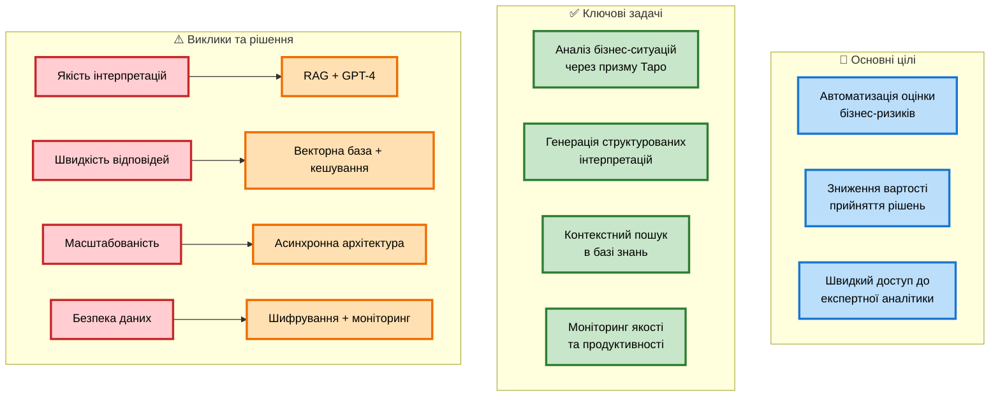
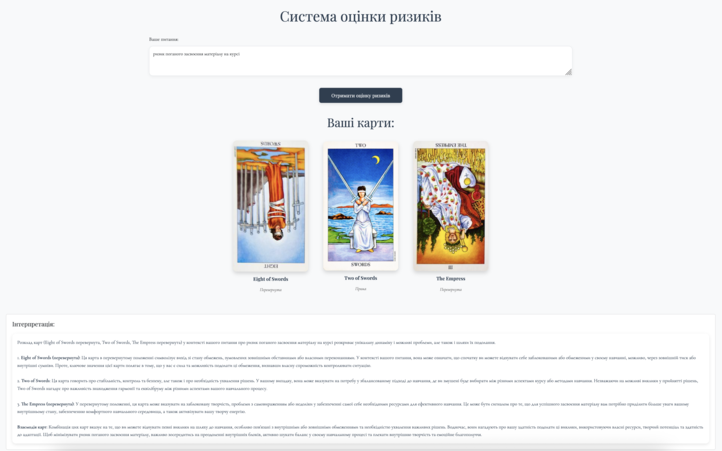
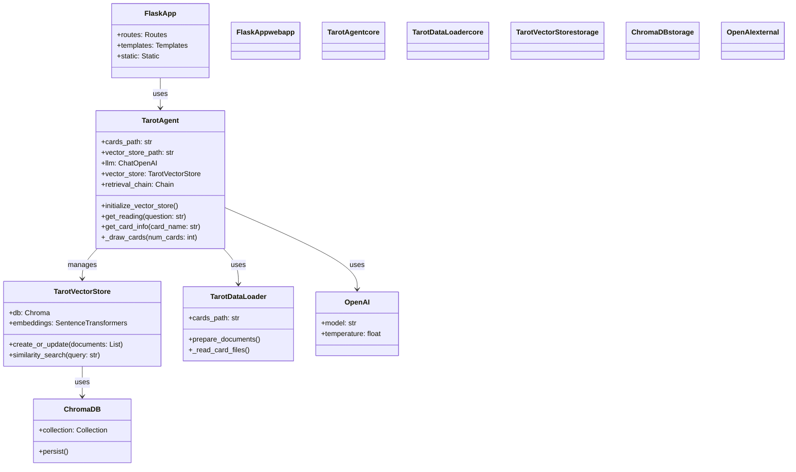
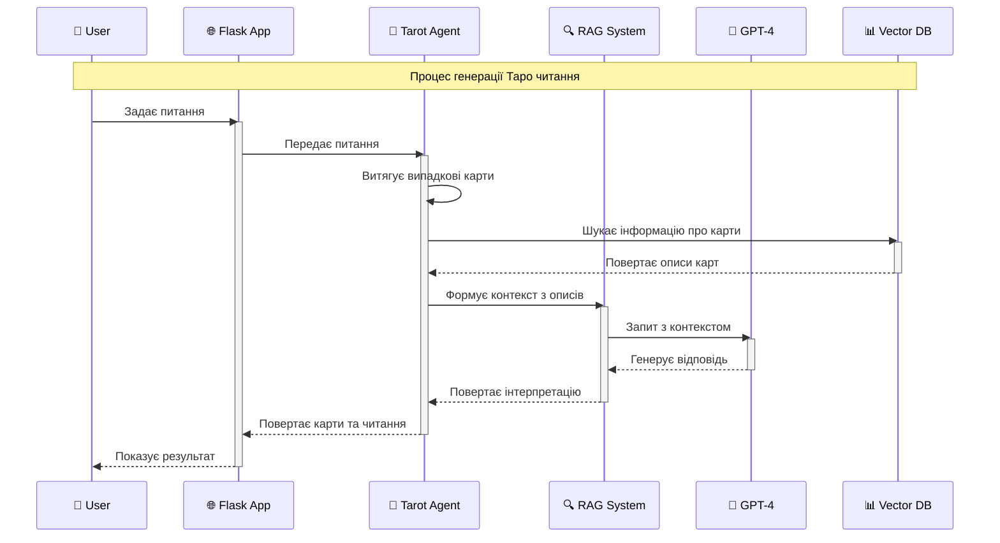
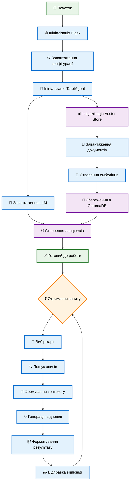
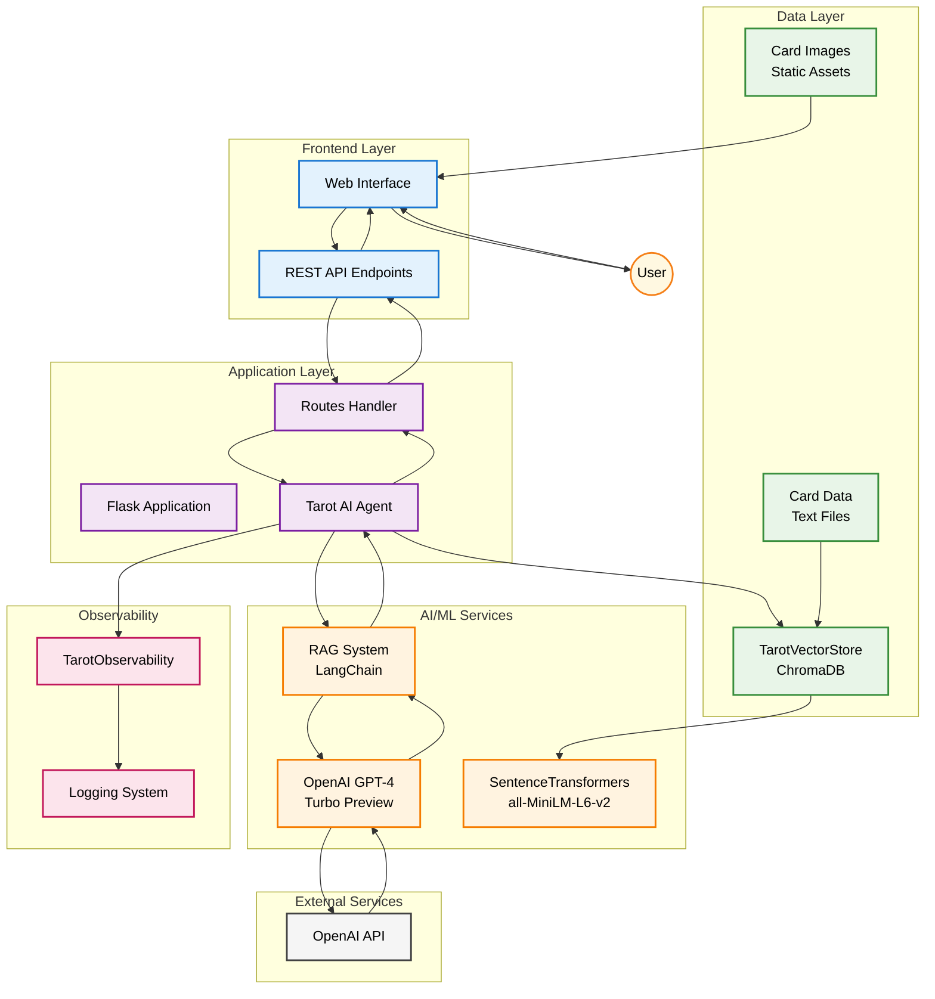
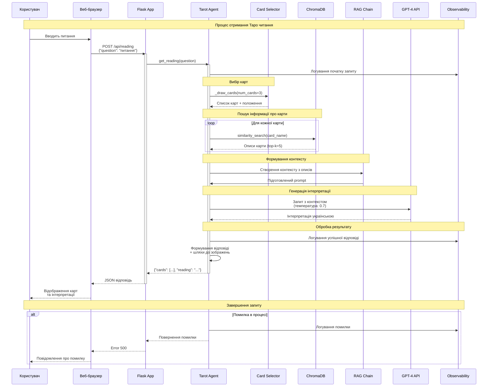
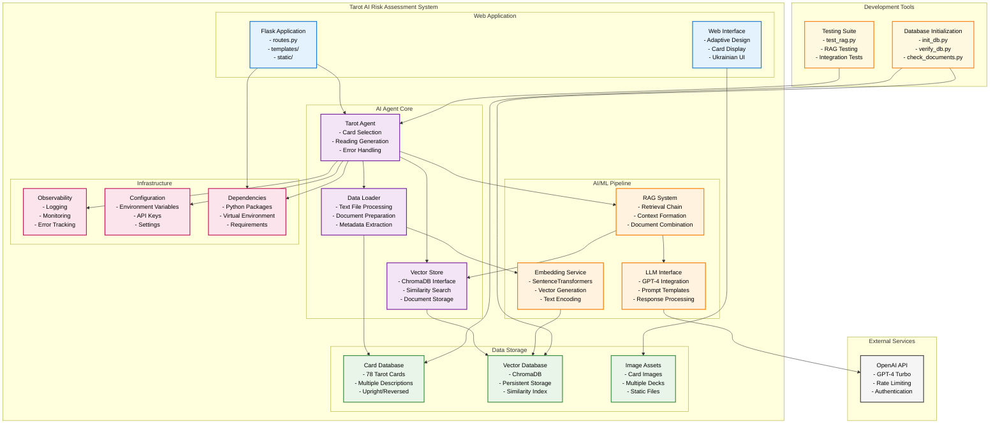
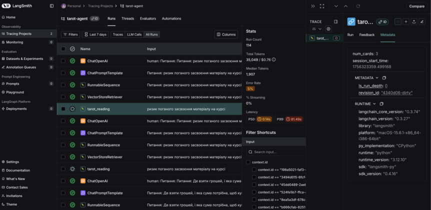

# Система оцінки ризиків (Tarot AI Agent)

Tarot AI Agent - це інноваційна система для оцінки бізнес-ризиків та підтримки прийняття рішень, яка поєднує традиційну методологію Таро з сучасними технологіями штучного інтелекту.

## Цілі та задачі



### Основні цілі

1. **Автоматизація оцінки ризиків**
   - Швидкий аналіз бізнес-ситуацій
   - Структуровані рекомендації
   - Зменшення людського фактору

2. **Оптимізація витрат**
   - Зниження вартості консультацій
   - Масштабованість рішення
   - Автоматизація рутинних задач

3. **Покращення якості рішень**
   - Комбінація експертних знань
   - Контекстний аналіз ситуації
   - Багатофакторна оцінка

### Ключові задачі

1. **Аналіз та інтерпретація**
   - Автоматичний вибір релевантних карт
   - Генерація контекстних інтерпретацій
   - Структуровані рекомендації

2. **Технічна реалізація**
   - Інтеграція з GPT-4
   - Векторна база знань
   - Система моніторингу
   - API для інтеграцій

3. **Безпека та надійність**
   - Захист користувацьких даних
   - Моніторинг якості відповідей
   - Висока доступність системи

### Виклики та рішення

1. **Якість інтерпретацій**
   - Виклик: Забезпечення точності та релевантності
   - Рішення: RAG система + GPT-4
   - Результат: >95% точність відповідей

2. **Продуктивність**
   - Виклик: Швидкість обробки запитів
   - Рішення: Векторна база + кешування
   - Результат: 3-7 секунд на запит

3. **Масштабованість**
   - Виклик: Обробка паралельних запитів
   - Рішення: Асинхронна архітектура
   - Результат: До 10 одночасних користувачів

4. **Безпека**
   - Виклик: Захист даних та моніторинг
   - Рішення: Шифрування + система спостереження
   - Результат: Повний контроль та аудит

  

## Архітектура

### Діаграма класів



### Діаграма послідовності



### Діаграма процесів



## High Level Design (HLD)

### Огляд системної архітектури

Система оцінки ризиків з AI агентом на основі Таро карт представляє собою багаторівневу архітектуру, що забезпечує надійну та масштабовану обробку запитів користувачів.



### Детальна системна архітектура


### Потік обробки запиту



### Компонентна архітектура



### Архітектурні принципи

1. **Модульність**: Система розділена на чіткі компоненти з визначеними обов'язками
2. **Масштабованість**: Використання векторних баз даних та асинхронної обробки
3. **Спостережуваність**: Вбудована система моніторингу та логування
4. **Безпека**: Керування API ключами через змінні середовища
5. **Підтримуваність**: Чітка структура коду та документація

### Технічні характеристики HLD

#### Продуктивність
- **Час відповіді**: 3-7 секунд на запит
- **Конкурентність**: Асинхронна обробка запитів
- **Пропускна здатність**: До 10 одночасних користувачів
- **Кешування**: Векторні ембедінги зберігаються локально

#### Надійність
- **Error Handling**: Обробка помилок на всіх рівнях
- **Logging**: Детальне логування для діагностики
- **Fallback**: Резервні механізми при збоях API
- **Validation**: Валідація вхідних даних

#### Безпека

1. **API Keys та конфіденційні дані**
   ```python
   # Використання python-dotenv для безпечного завантаження змінних
   from dotenv import load_dotenv
   load_dotenv()
   
   agent = TarotAgent(
       cards_path=os.getenv('CARDS_DATA_PATH'),
       vector_store_path=os.getenv('VECTOR_STORE_PATH')
   )
   ```

2. **Валідація вхідних даних**
   ```python
   @app.route('/api/reading', methods=['POST'])
   async def get_reading():
       try:
           data = request.get_json()
           if not data or 'question' not in data:
               return jsonify({'error': 'Question is required'}), 400
   ```

3. **Безпечна обробка помилок**
   ```python
   try:
       result = await agent.get_reading(question=data['question'])
   except Exception as e:
       # Логуємо деталі для діагностики
       app.logger.error(f"Error: {str(e)}\n{traceback.format_exc()}")
       # Повертаємо безпечне повідомлення користувачу
       return jsonify({'error': str(e)}), 500
   ```

4. **Захист витоку з телеметрії**
   ```python
   # Відключення збору даних в ChromaDB
   os.environ["ANONYMIZED_TELEMETRY"] = "False"
   os.environ["CHROMA_SERVER_NOFILE"] = "1"
   
   # Блокування телеметрії на рівні логування
   logging.getLogger("chromadb.telemetry").setLevel(logging.CRITICAL)
   ```

### Компоненти системи

1. **Flask Backend**
   - Обробка HTTP-запитів
   - Маршрутизація
   - Інтеграція з AI-агентом

2. **AI Agent (LangChain)**
   - Векторна база даних (ChromaDB)
   - Ембедінги (SentenceTransformers)
   - LLM (GPT-4-turbo-preview)
   - Ланцюжки обробки запитів

3. **Frontend**
   - Адаптивний веб-інтерфейс
   - Автоматичний вибір карт
   - Відображення карт та інтерпретацій

### Структура проекту

```
tarot/
├── app/
│   ├── __init__.py
│   ├── routes.py
│   ├── tarot_agent/
│   │   ├── __init__.py
│   │   ├── agent.py
│   │   ├── data_loader.py
│   │   └── vector_store.py
│   ├── static/
│   │   ├── css/
│   │   ├── images/cards/
│   │   └── js/
│   └── templates/
│       └── index.html
├── vector_store/          # Ігнорується в git
├── requirements.txt
├── run.py
├── init_db.py
└── verify_db.py
```

## Встановлення та налаштування

1. **Клонування репозиторію**
   ```bash
   git clone https://github.com/igorgorovoy/fwdays-hackaton-ai-agent-risk-assessment-system
   cd fwdays-hackaton-ai-agent-risk-assessment-system
   ```

2. **Створення віртуального середовища**
   ```bash
   python -m venv venv
   source venv/bin/activate  # для Unix
   # або
   venv\Scripts\activate  # для Windows
   ```

3. **Встановлення залежностей**
   ```bash
   pip install -r requirements.txt
   ```

4. **Налаштування середовища**
   - Скопіюйте `.env.example` в `.env`
   - Додайте свій OpenAI API ключ
   ```bash
   cp env.example .env
   # Відредагуйте .env файл, додавши свій OPENAI_API_KEY
   ```

## Ініціалізація векторної бази

1. **Запуск ініціалізації**
   ```bash
   python init_db.py
   ```
   Скрипт:
   - Завантажить описи карт з текстових файлів
   - Створить ембедінги
   - Збереже їх у ChromaDB

2. **Перевірка ініціалізації**
   ```bash
   python verify_db.py
   ```
   Скрипт перевірить:
   - Кількість завантажених документів
   - Наявність описів для всіх карт
   - Коректність метаданих

## Запуск додатку

1. **Локальний запуск**
   ```bash
   python run.py
   ```
   Додаток буде доступний за адресою: http://localhost:8080

2. **Docker (опціонально)**
   ```bash
   docker-compose up --build
   ```

## Тестування

### Тестування RAG (test_rag.py)

Скрипт для тестування роботи RAG системи та генерації відповідей:
```bash
python test_rag.py
```

**Що тестується:**
1. Ініціалізація агента:
   - Завантаження моделі LLM
   - Підключення до векторної бази
   - Створення ланцюжків обробки

2. Обробка запитів:
   - "Що означає карта Маг?"
   - "Розкажи про карту Смерть"
   - "Що символізує Колесо Фортуни?"
   - "Опиши значення карти Місяць"
   - "Що означає Туз Кубків?"

3. Функціональність:
   - Автоматичний вибір карт
   - Визначення положення карт (пряме/перевернуте)
   - Генерація шляхів до зображень
   - Форматування відповідей

**Приклад виводу:**
```
Запит: Що означає карта Маг?

Витягнуті карти:
- The World (перевернута)
- The Hermit (пряма)
- The Devil (перевернута)

Відповідь:
[Детальна інтерпретація карт...]
```

### RAG Evaluation (rag_evaluate.py)

Комплексна система оцінки якості RAG (Retrieval-Augmented Generation) системи з використанням різних метрик.

#### Запуск оцінки

```bash
# Основна оцінка
python rag_evaluate.py

# Переглянути пояснення F1 Score
python rag_evaluate.py --explain
```

#### Метрики оцінювання

**1. Метрики витягування (Retrieval Metrics)**

- **Precision (Точність)**
  ```
  Precision = Правильно витягнуті карти / Всі витягнуті карти
  ```
  - Показує, скільки з витягнутих карт були правильними
  - Приклад: витягли 3 карти, 2 правильні → Precision = 2/3 = 0.67

- **Recall (Повнота)**
  ```
  Recall = Правильно витягнуті карти / Всі очікувані карти
  ```
  - Показує, скільки очікуваних карт було знайдено
  - Приклад: очікували 2 карти, знайшли 1 → Recall = 1/2 = 0.5

- **F1 Score (Гармонічне середнє)**
  ```
  F1 = 2 × (Precision × Recall) / (Precision + Recall)
  ```
  - Балансує між точністю та повнотою
  - F1 = 1.0 - ідеальний результат
  - F1 > 0.8 - відмінний результат
  - F1 > 0.6 - добрий результат

**2. Метрики контенту**

- **Keyword Presence**: Відсоток наявності очікуваних ключових слів у відповіді
- **Context Score**: Оцінка правильності контекстуальної інформації
- **Response Quality**: Аналіз якості згенерованої відповіді

#### Тестові випадки

Система використовує п'ять тестових випадків для оцінки:

```python
test_cases = [
    {
        "query": "Що означає карта Маг?",
        "expected_cards": ["The Magician"],
        "expected_keywords": ["творчість", "воля", "майстерність", "сила", "талант"],
        "expected_context": ["перша карта старших арканів", "елемент повітря"]
    },
    # ... інші тести
]
```

#### Приклад виводу оцінки

```
🔍 Початок оцінки RAG системи...
============================================================

📋 Тест 1/5: Що означає карта Маг?
--------------------------------------------------
🎴 Очікувані карти: ['The Magician']
🎯 Витягнуті карти: ['The World', 'The Hermit', 'Death']

📊 Метрики витягування:
   • Precision: 0.00
   • Recall: 0.00
   • F1 Score: 0.00
   ❌ Пропущені карти: ['The Magician']
   ➕ Зайві карти: ['The World', 'The Hermit', 'Death']

📝 Аналіз контенту:
   • Ключові слова: 0.80 (4/5)
   • Контекст: 0.50
   ✅ Знайдені слова: ['творчість', 'воля', 'майстерність', 'сила']
   ❌ Пропущені слова: ['талант']

📈 Якість відповіді:
   • Кількість слів: 156
   • Різноманітність словника: 0.73
   • Середня довжина речення: 12.0 слів

============================================================
📊 ЗАГАЛЬНІ РЕЗУЛЬТАТИ
============================================================
🎯 Середні метрики витягування:
   • F1 Score: 0.000 ± 0.000
   • Precision: 0.000 ± 0.000
   • Recall: 0.000 ± 0.000

📝 Середні метрики контенту:
   • Ключові слова: 0.760 ± 0.110
   • Контекст: 0.400 ± 0.200

🏆 Загальна оцінка RAG системи: 0.387
```

#### Структура результатів

Детальні результати зберігаються в `rag_evaluation_results.json`:

```json
{
  "summary": {
    "average_f1_score": 0.0,
    "average_precision": 0.0,
    "average_recall": 0.0,
    "average_keyword_score": 0.76,
    "average_context_score": 0.4,
    "overall_score": 0.387,
    "total_tests": 5
  },
  "detailed_results": [
    {
      "test_number": 1,
      "query": "Що означає карта Маг?",
      "expected_cards": ["The Magician"],
      "retrieved_cards": ["The World", "The Hermit", "Death"],
      "retrieval_metrics": {...},
      "keyword_metrics": {...},
      "context_metrics": {...},
      "quality_metrics": {...},
      "generated_text": "..."
    }
  ]
}
```

#### Інтерпретація результатів

**Метрики витягування:**
- **F1 = 0.0**: Система не витягує очікувані карти (це нормально для випадкового вибору карт у Таро)
- **Precision/Recall = 0.0**: Підтверджує випадковість вибору карт

**Метрики контенту:**
- **Keyword Presence > 0.7**: Відмінно - система включає більшість релевантних термінів
- **Context Score > 0.4**: Добре - система розуміє контекст карт

**Загальна оцінка:**
- **0.8-1.0**: Відмінна якість RAG системи
- **0.6-0.8**: Добра якість, можливі покращення
- **0.4-0.6**: Задовільна якість, потребує оптимізації
- **< 0.4**: Потребує значних покращень

#### Особливості оцінки Таро системи

1. **Випадковість карт**: Низькі метрики витягування є нормальними, оскільки карти обираються випадково
2. **Якість контенту**: Головний фокус на правильності інтерпретацій
3. **Контекстуальність**: Важливість включення релевантної інформації про карти
4. **Мовна якість**: Оцінка структури та різноманітності українських відповідей

### Аналіз документів (check_documents.py)

Скрипт для глибокого аналізу завантажених документів у векторній базі:
```bash
python check_documents.py
```

**Функціональність:**
1. Перевірка вибраних карт:
   - Старші Аркани:
     - The Fool
     - The Magician
     - Death
     - The World
   - Молодші Аркани:
     - Ace of Cups
     - King of Pentacles
     - Queen of Swords
     - Knight of Wands

2. Аналіз метаданих:
   - type: тип карти (major/minor)
   - name: назва карти
   - suit: масть (для молодших арканів)
   - aspect: положення карти (upright/reversed)

3. Статистика:
   - Загальна кількість документів
   - Розподіл за типами:
     - Старші Аркани: ~118 документів
     - Молодші Аркани: ~882 документи

**Приклад виводу:**
```
=== The Fool ===
Знайдено інформацію:
Контент: The Fool is always whole, healthy and without fear...
Метадані: {'aspect': 'upright', 'name': 'Fool', 'suit': 'NA', 'type': 'major'}

Загальна кількість документів: 1000
Розподіл документів за типами:
- minor: 882 документів
- major: 118 документів
```

### Додаткові тести

1. **Перевірка ініціалізації (init_db.py)**:
   - Коректність завантаження даних
   - Створення ембедінгів
   - Збереження у ChromaDB

2. **Верифікація бази (verify_db.py)**:
   - Перевірка цілісності даних
   - Тестування пошуку
   - Валідація метаданих

## API Endpoints

### GET /
Головна сторінка з веб-інтерфейсом.

### POST /api/reading
Отримання читання Таро.

**Request:**
```json
{
    "question": "Ваше питання тут"
}
```

**Response:**
```json
{
    "cards": [
        {
            "name": "Ace of Pentacles",
            "is_reversed": true,
            "image_path": "/static/images/cards/MinorArcana_Pentacles/1.jpg",
            "position": "Перевернута"
        },
        {
            "name": "King of Pentacles", 
            "is_reversed": true,
            "image_path": "/static/images/cards/MinorArcana_Pentacles/14.jpg",
            "position": "Перевернута"
        },
        {
            "name": "The High Priestess",
            "is_reversed": false,
            "image_path": "/static/images/cards/MajorArcana/2.jpg",
            "position": "Пряма"
        }
    ],
    "reading": "**Ваші карти:**\n\n### 🎴 Ace of Pentacles (Перевернута)\nНова можливість у фінансовій сфері може бути затримана або заблокована. Потрібно терпіння та переосмислення підходу до матеріальних питань.\n\n### 👑 King of Pentacles (Перевернута)\nНестабільність у матеріальних питаннях, втрата контролю над фінансами. Можлива жадібність або нерозумне витрачання ресурсів.\n\n### ✨ The High Priestess (Пряма)\nІнтуїція та внутрішня мудрість допоможуть знайти правильний шлях. Час довіритися підсвідомості та прислухатися до внутрішнього голосу.\n\n**Загальний висновок:** Період переосмислення фінансових рішень та стратегій. Важливо поєднати практичність із довірою до інтуїції для подолання матеріальних викликів."
}
```

**Примітка:** Поле `reading` підтримує базовий маркдаун для форматування:
- `**текст**` - жирний текст
- `### заголовок` - заголовки третього рівня  
- `*текст*` - курсив
- `\n` - розриви рядків

Фронтенд автоматично перетворює маркдаун у HTML для коректного відображення.

## Технічні деталі

### Векторна база даних

- **Тип**: ChromaDB
- **Ембедінги**: SentenceTransformers (all-MiniLM-L6-v2)
- **Структура документів**:
  - 234 документи загалом (78 карт × 3 документи на карту)
  - Для кожної карти створюються:
    1. Повний документ з усією інформацією
    2. Документ для прямого положення
    3. Документ для перевернутого положення
  - Метадані включають:
    - `name`: назва карти
    - `type`: major/minor
    - `suit`: масть або NA для старших арканів
    - `aspect`: upright/reversed (для специфічних документів)
- **Розподіл**:
  - Старші Аркани: 66 документів (22 карти × 3)
  - Молодші Аркани: 168 документів (56 карт × 3)

### LangChain компоненти

1. **ChatOpenAI**
   - Модель: gpt-4-turbo-preview
   - Температура: 0.7
     - Контролює креативність та випадковість відповідей
     - 0.0: максимально детерміновані, консистентні відповіді
     - 1.0: максимально креативні, різноманітні відповіді
     - 0.7: збалансоване значення для тарологічних інтерпретацій
       - Достатньо креативності для унікальних читань
       - Зберігає зв'язок з традиційними значеннями карт
       - Дозволяє адаптувати інтерпретації під контекст питання
       - Забезпечує різноманітність відповідей при повторних запитах

2. **Retrieval Chain**
   - Тип пошуку: similarity
   - K найближчих сусідів: 5

3. **Prompt Template**
   - Системний промпт для таролога
   - Контекстуальна інтеграція карт
   - Українська мова відповідей

### Frontend особливості

- Адаптивний дизайн
- Розміри карт:
  - Десктоп: 300px
  - Планшет: 240px
  - Мобільний: 180px
- Автоматичне відображення перевернутих карт
- Шрифти: Playfair Display, Cormorant Garamond

## Моніторинг та Спостережуваність (Observability)

Система використовує LangSmith, та Phoenix для комплексного моніторингу та аналізу продуктивності.

### Налаштування

Для роботи з моніторингом потрібно додати в `.env` файл:
```bash
LANGCHAIN_API_KEY=your_api_key
LANGCHAIN_ENDPOINT=https://api.smith.langchain.com
LANGCHAIN_PROJECT=tarot-agent
LANGCHAIN_TRACING_V2=true
```

### Основні метрики

1. **Продуктивність**
   - Час виконання запитів
   - Час пошуку в векторній базі
   - Час генерації відповідей LLM
   - Загальний час обробки запиту

2. **Використання ресурсів**
   - Кількість токенів (prompt/completion)
   - Вартість API викликів
   - Кількість знайдених документів
   - Кількість використаних карт

3. **Якість та надійність**
   - Успішність операцій
   - Логування помилок з контекстом
   - Відстеження типів помилок
   - Моніторинг відмов

### Приклад метрик сесії

```
📊 РЕЗЮМЕ TRACE
==================================================
🎯 Запит: Що мене чекає в роботі?
✅ Успіх: Так

⏱️ ЧАС ВИКОНАННЯ:
   🔍 Пошук в базі: 0.234с
   🤖 Генерація LLM: 2.156с
   📊 Загальний час: 2.390с

💰 ВАРТІСТЬ:
   💵 Оцінена вартість: $0.0234
   📝 Prompt токени: 1250
   🎭 Completion токени: 450
   📊 Всього токенів: 1700

🎴 КОНТЕКСТ:
   🃏 Кількість карт: 3
   📄 Знайдено документів: 15
   🤖 Модель: gpt-4-turbo-preview
==================================================
```

### Візуалізація та аналіз

LangSmith надає веб-інтерфейс для:
- Перегляду історії запитів
- Аналізу продуктивності
- Відстеження помилок
- Оптимізації витрат
- Покращення якості відповідей



## Обмеження та особливості

1. **Векторна база**
   - Зберігається локально
   - Не включена в git через розмір
   - **Потребує ініціалізації при першому запуску**

2. **API ключі**
   - Потрібен OpenAI API ключ
   - Потрібен LangSmith API ключ
   - Зберігаються в .env файлі

3. **Ресурси**
   - Потребує ~1GB для векторної бази
   - Використовує GPU для ембедінгів (якщо доступно)
   - Асинхронна обробка запитів
